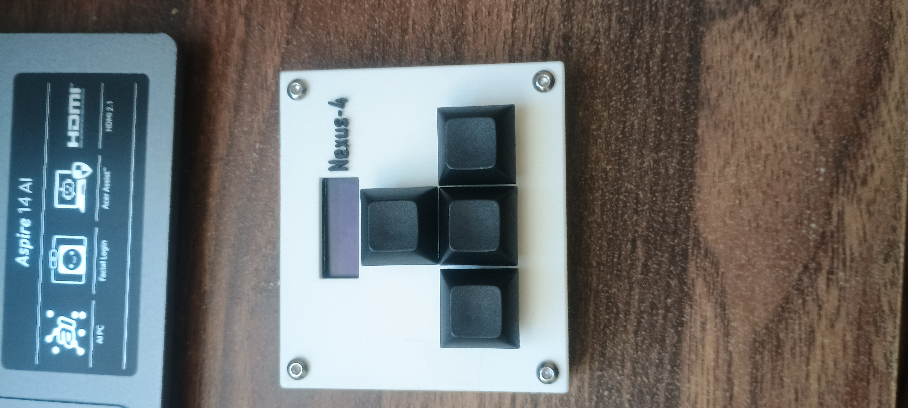
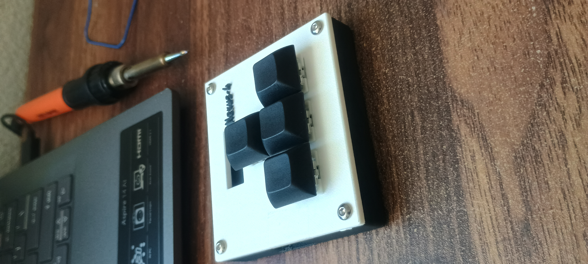
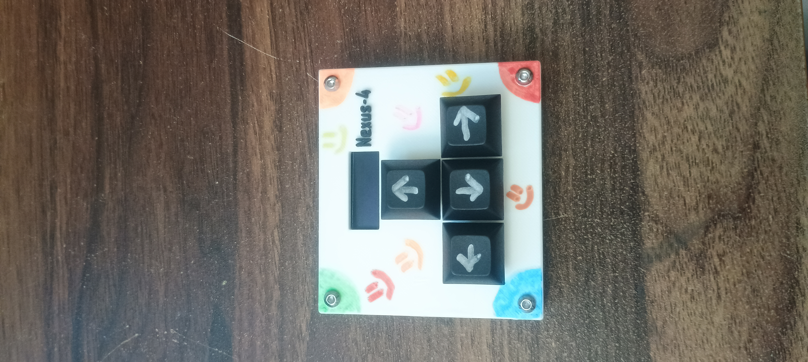
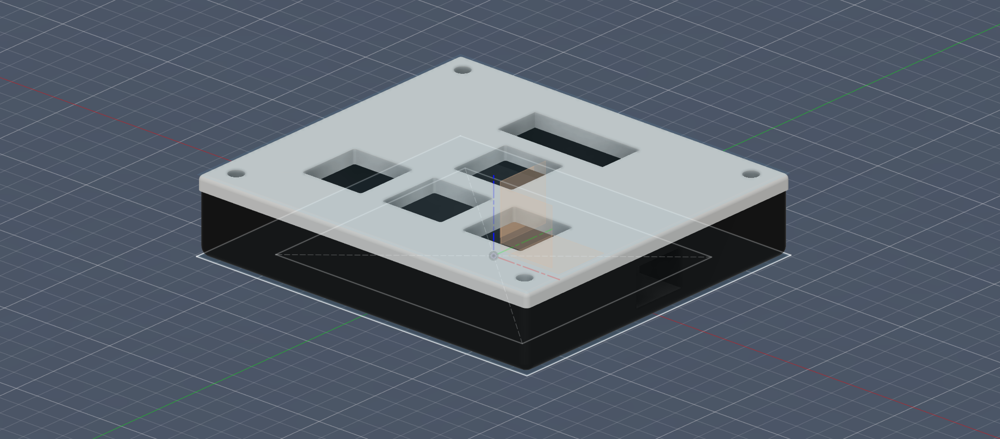
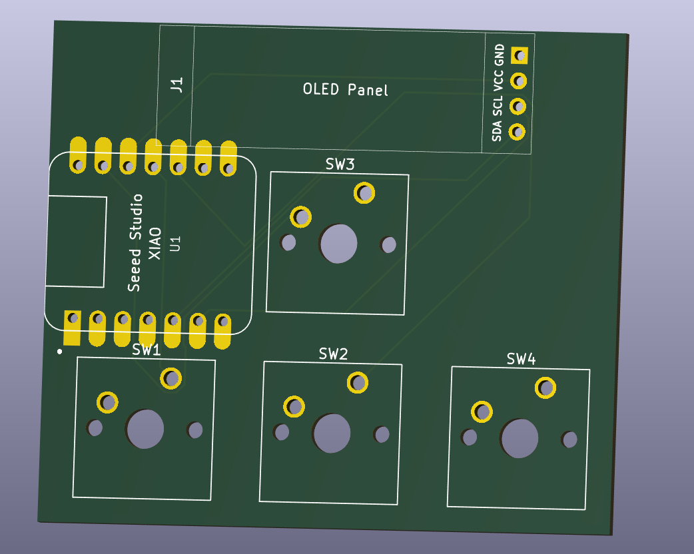
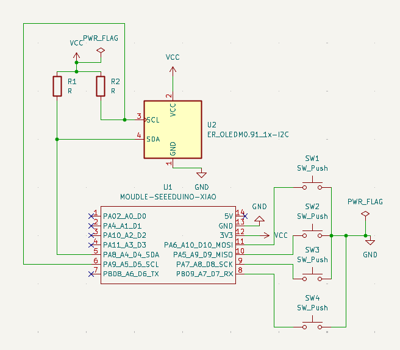
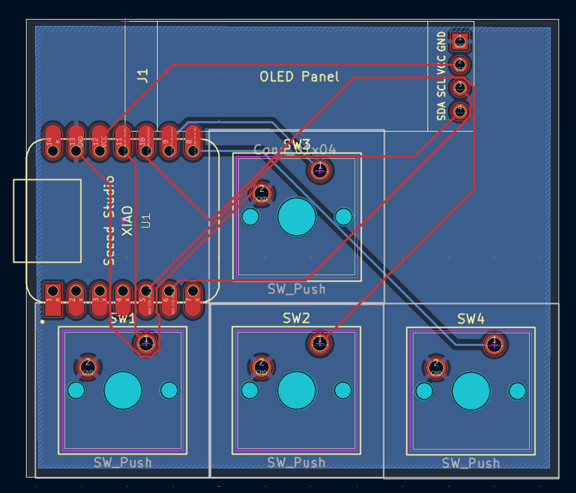

# Nexus-4 (my first piece of hardware)

Okay, okay, okay. Let me introduce you to Nexus-4, a custom 4-key macropad. It features an inverted-T arrow key layout, a 128x32 OLED display, and a 3D-printed sandwich-mount case. So I run the the software of this on a Seeed Studio XIAO RP2040 that runs my custom QMK firmware. I've even made some simple ASCII art animations(currently very simple tho)!

---

## Completed Build & Demo

<p align="center">
  
  
  
</p>

### Video Demonstration
[Watch the Nexus-4 in action](https://drive.google.com/file/d/1Elsz5yWcckBbZZuh22iVLzsOhnGGIkVX/view?usp=sharing)

---

## Features
* **Custom 3D-Printed Enclosure:** Two-piece sandwich-mount case (Top Plate + Bottom Enclosure) secured by corner hardware.
* **Interactive OLED Animation:** 0.91" 128x32 I2C OLED display rendering dynamic ASCII expressions that react to keystroke directions in real-time.
* **Direct-Pin GPIO Routing:** Low-latency direct pin mapping utilizing RP2040 GPIOs without a matrix diode drop.
* **QMK Powered:** Full QMK firmware configuration including bootmagic rescue support and custom animation loops.

---

## Hardware & CAD Design

The enclosure consists of a rigid sandwich-mount structure designed in Autodesk Fusion 360. The 1.6mm PCB rests securely inside the 13mm cavity of the bottom housing, capped by a 3mm top plate and bolted together at the perimeter corners. A dedicated side cutout provides access to the XIAO RP2040's USB-C connector.

<p align="center">
  
  
</p>

---

## PCB & Schematic

The PCB was designed and routed in KiCad using direct-pin connections to simplify the layout and reduce component count.

* **Microcontroller:** Seeed Studio XIAO RP2040
* **Display Interface:** I2C (SDA on `GP6`, SCL on `GP7`)
* **Switch Routing:**
  * **Up Switch (SW1):** `GP2` (Pin D8 / SCK)
  * **Left Switch (SW2):** `GP3` (Pin D10 / MOSI)
  * **Down Switch (SW3):** `GP4` (Pin D9 / MISO)
  * **Right Switch (SW4):** `GP1` (Pin D7 / RX)

<p align="center">
  
  
</p>

---

## Firmware & OLED Logic

The firmware is compiled with QMK for the RP2040 (`promicro_rp2040` target).

Layout:
* `KC_UP` (Up Arrow)
* `KC_LEFT` (Left Arrow)
* `KC_DOWN` (Down Arrow)
* `KC_RIGHT` (Right Arrow)

* **Keymaps:** Mapped to standard navigation keys (`KC_UP`, `KC_LEFT`, `KC_DOWN`, `KC_RIGHT`).
* **OLED Engine:** The screen renders an inverted, centered ASCII expression engine. When idle, a breathing sleep animation (`zZz`) cycles continuously. Pressing any key triggers `process_record_user()` to update the active expression in the direction of input (`owo`, `>_<`, `o_o`, `-w-`).

---

## Bill of Materials (BOM)

| Category | Component | Quantity | Notes |
| :--- | :--- | :--- | :--- |
| **Electronics** | Seeed Studio XIAO RP2040 | 1 | Surface-soldered via castellations |
| **Electronics** | 0.91" 128x32 I2C OLED Display | 1 | Flush-mounted using bare pin headers |
| **Electronics** | Cherry MX-Compatible Switches | 4 | Linear / Tactile switches |
| **Electronics** | Custom 2-Layer PCB | 1 | Fabricated via JLCPCB |
| **Hardware** | 3D-Printed Top Plate | 1 | PLA/PETG |
| **Hardware** | 3D-Printed Bottom Case | 1 | PLA/PETG |
| **Hardware** | M4 (or M3) Screws & Nuts | 4 | Corner clamp fasteners |
| **Keycaps** | 1u Keycaps | 4 | DSA or OEM profile |

---

## Assembly & Flashing

1. **Surface-Mount the MCU:** Direct-solder the Seeed XIAO RP2040 flat to the PCB pads using its castellated edges to preserve vertical clearance.
2. **Mount the OLED:** Strip the plastic collar from the 4-pin header and solder the bare pins flush between the OLED and PCB.
3. **Mount the Switches:** Seat the 4 switches through the top plate and solder their pins directly to the PCB through-holes.
4. **Enclosure Assembly:** Drop the PCB assembly into the bottom case and secure the sandwich using four corner bolts and nuts.
5. **Flash Firmware:**
   * Enter bootloader mode by holding the **Boot** key or grounding `GP26` (`D0`) on startup to mount the `RPI-RP2` drive.
   * Compile and copy the `.uf2` file:
     ```bash
     qmk compile -kb taksh_macropad -km default
     ```
   * Drag and drop `Nexus-4_default` into `RPI-RP2`.

---

## Build Retrospective

* **What Went Well:** Learning PCB layout in KiCad, engineering tight vertical clearance solutions (castellated soldering and header trimming), and writing custom display drivers in QMK.
* **Future Improvements:** Expanding to an 8+ key layout with dedicated rotary encoders and experimenting with a larger graphic LCD or RGB matrix display for multi-frame bitmap animations.